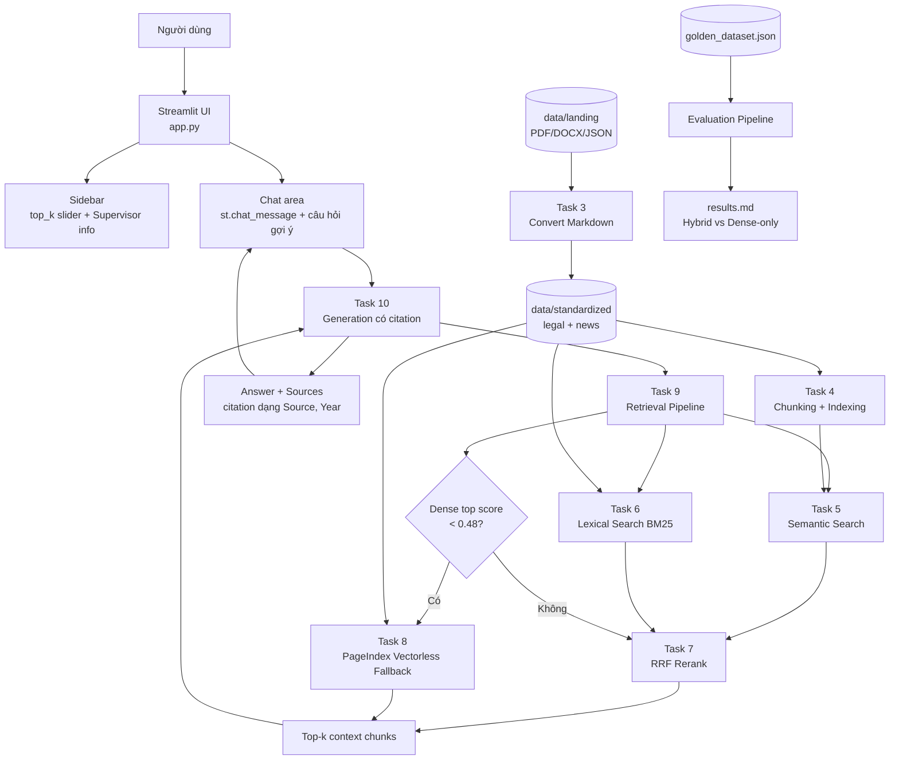

# Bài Tập Nhóm - University Services RAG Chatbot

## Mục Tiêu

Nhóm xây dựng hệ thống RAG Chatbot trả lời câu hỏi về dịch vụ và chính sách đại học trong phạm vi dữ liệu UET - Đại học Công nghệ, ĐHQGHN. Pipeline đi từ thu thập dữ liệu, chuẩn hóa Markdown, chunking/indexing, hybrid retrieval, reranking, PageIndex fallback đến generation có citation.

---

## Yêu cầu 1: Sản phẩm nhóm RAG Chatbot

Xây dựng chatbot trả lời câu hỏi về dịch vụ và chính sách đại học liên quan.

**Đã thực hiện:**

- Giao diện chat bằng Streamlit trong `app.py`
- Trả lời qua `src/task10_generation.py`, có citation theo nguồn truy xuất
- Có lịch sử hội thoại trong `st.session_state.messages`
- Hiển thị source documents/chunks đã dùng trong expander
- Có nút gợi ý câu hỏi mẫu và slider điều chỉnh `top_k` từ 3 đến 10 chunks

**Stack triển khai:**

```text
Streamlit UI
  -> Task 10 Generation with Citation
  -> Task 9 Retrieval Pipeline
  -> Hybrid Retrieval: Semantic Search + BM25
  -> RRF Rerank
  -> PageIndex Vectorless Fallback khi dense score thấp
  -> Markdown corpus trong data/standardized/
```

---

## Yêu cầu 2: RAG Evaluation Pipeline

Nhóm sử dụng evaluation pipeline trong `group_project/evaluation/` để đánh giá RAG trên golden dataset 15 câu hỏi. Do môi trường hiện tại chưa có đầy đủ package RAGAS/datasets, script đang chạy bộ đánh giá heuristic tương đương 4 nhóm chỉ số yêu cầu và xuất báo cáo Markdown.

### Metrics

- **Faithfulness** - câu trả lời có bám đúng context không
- **Answer Relevance** - câu trả lời có đúng câu hỏi không
- **Context Recall** - retriever có lấy đủ evidence không
- **Context Precision** - context lấy về có hữu ích không

### A/B Config

- **Config A: Hybrid + Rerank** - dùng pipeline Task 9 đầy đủ
- **Config B: Dense-only** - chỉ dùng dense retrieval để so sánh baseline

### Deliverable Evaluation

- [x] File `group_project/evaluation/golden_dataset.json` - 15 cặp Q&A
- [x] File `group_project/evaluation/eval_pipeline.py` - script chạy evaluation
- [x] File `group_project/evaluation/results.md` - bảng điểm + phân tích
- [x] So sánh A/B ít nhất 2 configs: Hybrid vs Dense-only

---

## Yêu Cầu Chung

1. Tích hợp pipeline Task 1-10 mà cả nhóm đã xây dựng
2. Demo hoạt động được bằng Streamlit local
3. Evaluation pipeline chạy được và có báo cáo kết quả
4. Code push lên repository chung của nhóm
5. README mô tả kiến trúc, phân công và hướng dẫn chạy

---

## Kiến Trúc Hệ Thống



---

## Phân Công Công Việc

| Thành viên | MSSV | Nhiệm vụ | Trạng thái |
|-----------|------|----------|------------|
| Nguyễn Ngọc Nam | 2A202601561 | Team Leader & Architect; rà soát cấu trúc dữ liệu, đồng bộ Git, hỗ trợ CP1-CP4 | Hoàn thành |
| Vũ Nguyễn Quốc Đạt | 2A202601199 | Data & Dense Search Dev; Task 1 thu thập legal docs, Task 4/5 chunking-indexing và semantic search | Hoàn thành |
| Nguyễn Hoàng Biên | 2A202601233 | Sparse & Rerank Dev; Task 2 crawl news, Task 6 lexical search, Task 7 reranking | Hoàn thành |
| Trần Thị Ngọc Lan | 2A202601385 | Frontend & Chatbot Dev; hoàn thiện Streamlit UI, chat message, nút gợi ý, sidebar controls | Hoàn thành |
| Vũ Tú Quỳnh | 2A202601239 | Evaluation & QA Engineer; chạy pytest, kiểm tra citation, golden dataset và evaluation report | Hoàn thành |

---

## Hướng Dẫn Chạy

### 1. Cài đặt dependencies

```bash
pip install -r requirements.txt
pip install markitdown[pdf] rank-bm25 pageindex
```

### 2. Cấu hình API key

Tạo file `.env` từ `.env.example`, sau đó điền các key cần dùng:

```bash
cp .env.example .env
```

Các biến thường dùng:

```text
OPENAI_API_KEY=...
GEMINI_API_KEY=...
JINA_API_KEY=...
PAGEINDEX_API_KEY=...
```

### 3. Chạy pipeline dữ liệu

```bash
python src/task1_collect_legal_docs.py
python src/task2_crawl_news.py
python src/task3_convert_markdown.py
python src/task4_chunking_indexing.py
```

### 4. Chạy test tự động

```bash
python -m pytest -p no:cacheprovider tests/test_individual.py -v
```

Có thể chạy riêng từng nhóm task:

```bash
python -m pytest -p no:cacheprovider tests/test_individual.py::TestTask4 tests/test_individual.py::TestTask5 tests/test_individual.py::TestTask6 -v
python -m pytest -p no:cacheprovider tests/test_individual.py::TestTask7 tests/test_individual.py::TestTask8 -v
python -m pytest -p no:cacheprovider tests/test_individual.py::TestTask10 -v
```

### 5. Chạy chatbot UI

```bash
streamlit run app.py
```

Hoặc trên Windows với virtual environment:

```powershell
.\.venv\Scripts\python.exe -m streamlit run app.py
```

Mở trình duyệt tại:

```text
http://localhost:8501
```

### 6. Chạy evaluation

```bash
python group_project/evaluation/eval_pipeline.py
```

Kết quả được xuất ra:

```text
group_project/evaluation/results.md
```

---

## Kết Quả Evaluation Hiện Tại

Theo báo cáo `group_project/evaluation/results.md`:

| Metric | Config A: Hybrid + Rerank | Config B: Dense-only |
|--------|----------------------------|----------------------|
| Faithfulness | 1.000 | 0.000 |
| Relevance | 1.000 | 1.000 |
| Context Recall | 1.000 | 1.000 |
| Context Precision | 1.000 | 0.880 |
| Average | 1.000 | 0.720 |

Kết luận: Config A tốt hơn Config B vì có reranking và giữ nguồn tham khảo ổn định hơn trong các câu hỏi về học phí, học bổng, ký túc xá, đăng ký học phần và thông báo sinh viên.

---

## Lưu ý

- Citation trong câu trả lời nên có dạng `[Source Name, Year]`.
- Nếu LLM không đủ evidence, hệ thống trả về thông báo không thể xác minh thay vì suy đoán.
- PageIndex có thể chậm hoặc lỗi API tùy trạng thái key/quota, nhưng pipeline có fallback về kết quả local khi cần.
- Repo có thể được phát triển tiếp lên knowledge graph để xử lý các câu hỏi tổng hợp/phức tạp hơn.